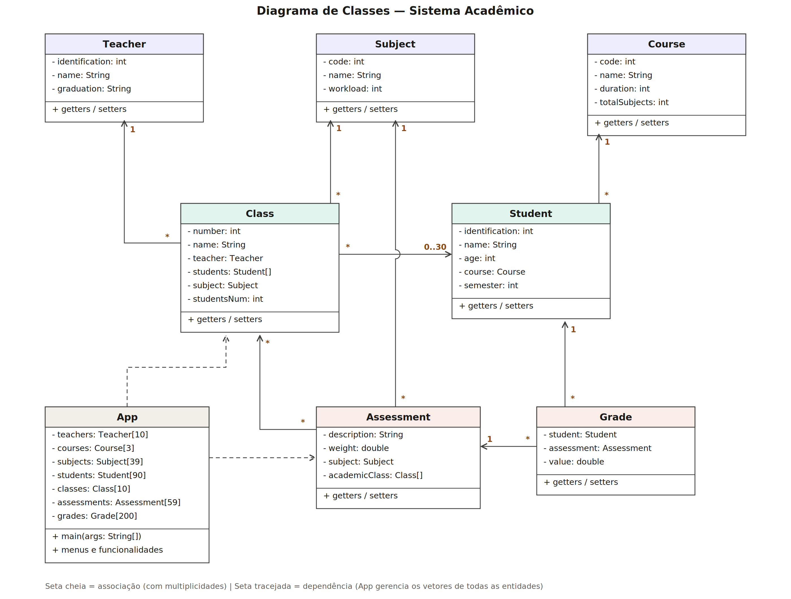

# Sistema de Gerenciamento Acadêmico

Trabalho final da disciplina de **Fundamentos de Programação**.

A ideia do projeto é simular um sistema acadêmico de uma faculdade, onde dá pra cadastrar alunos, professores e turmas, registrar notas nas avaliações e depois consultar um monte de informações: médias, rankings, boletins, buscas e por aí vai. Tudo roda no console, direto no terminal.

---

## Sumário

1. [Integrantes do grupo](#integrantes-do-grupo)
2. [Como funciona](#como-funciona)
3. [Funcionalidades](#funcionalidades)
4. [Diagrama de classes do projeto](#diagrama-de-classes-do-projeto)
5. [Estrutura do projeto](#estrutura-do-projeto)
6. [Conceitos da disciplina usados](#conceitos-da-disciplina-usados)
7. [Como executar](#como-executar)
8. [Fontes utilizadas](#fontes-utilizadas)
9. [Uso de Inteligência Artificial](#uso-de-inteligência-artificial)
10. [Observações](#observações)
11. [Dificuldades encontradas](#dificuldades-encontradas)
12. [Divisão de tarefas](#divisão-de-tarefas)
13. [Lições aprendidas](#lições-aprendidas)
14. [Reflexão sobre o desenvolvimento](#reflexão-sobre-o-desenvolvimento)

---

## Integrantes do grupo

- Leonardo Antoniuk - 26103880
- João Vitor - 26103549
- José Lucas Freitas - 26103574
- Gabriel Gemelli Bonadiman - 26102989

---

## Como funciona

Quando o programa inicia, ele já vem com **3 cursos**, **39 matérias** e **59 avaliações** pré-cadastrados (isso foi combinado em aula, pra não ter que digitar tudo toda vez que fosse testar). A partir daí, o menu principal oferece 6 áreas:

```
0 - Encerrar o programa
1 - Cadastros
2 - Alterações
3 - Informações
4 - Rankings
5 - Médias
6 - Busca
```

### Funcionalidades

- **Cadastros:** professores, turmas, alunos, notas e adicionar aluno em uma turma (cada turma tem limite de 30 alunos).
- **Alterações:** dá pra editar praticamente tudo depois de cadastrado — nome/formação do professor, nome/idade/curso/semestre do aluno, dados da turma e até corrigir uma nota já lançada.
- **Informações:** listagens completas de professores, alunos (todos ou um específico, mostrando a média e se está aprovado), turmas, cursos, matérias, avaliações, todas as notas registradas e o **boletim da turma**, que monta uma matriz de alunos × avaliações com a média ponderada de cada um.
- **Rankings:** ranking de notas individuais e ranking de média geral dos alunos, os dois podendo ser ordenados do maior pro menor ou do menor pro maior.
- **Médias:** média da turma por matéria, média do aluno em cada matéria, média do curso, média da matéria e média geral de tudo que foi lançado.
- **Busca:** procurar professor, aluno, turma, curso ou matéria pelo nome (busca parcial, sem diferenciar maiúsculas de minúsculas).

---

## Diagrama de classes do projeto

<div align="center">



</div>

O diagrama está organizado em três camadas. Na de cima ficam as classes base (`Teacher`, `Subject` e `Course`), que não dependem de nenhuma outra. No meio fica o núcleo: `Student` se associa a um `Course` (todo aluno pertence a um curso) e `Class` faz a **composição** central do sistema — uma turma é composta por um professor, uma matéria e um vetor de até 30 alunos. Embaixo fica a parte de avaliação: `Assessment` pertence a uma matéria, e `Grade` é a classe associativa que liga um aluno a uma avaliação com o valor da nota. A `App` (setas tracejadas) não é uma entidade: é a classe controladora, que guarda os vetores de todos os objetos e concentra os menus.

Os números nas linhas são as multiplicidades: por exemplo, `Class * — 1 Teacher` significa que várias turmas podem ter o mesmo professor, mas cada turma tem exatamente um; e `Class 1 — 0..30 Student` mostra que a turma comporta de zero a trinta alunos, que é o tamanho do vetor `students` no código.

## Estrutura do projeto

O projeto foi dividido em classes, cada uma representando uma "coisa" do mundo real:

| Classe | O que representa |
|---|---|
| `Student` | Aluno (ID, nome, idade, curso e semestre atual) |
| `Teacher` | Professor (ID, nome e formação) |
| `Course` | Curso (código, nome, duração em semestres e total de matérias) |
| `Subject` | Matéria (código, nome e carga horária) |
| `Class` | Turma (número, nome, professor, matéria e vetor de até 30 alunos) |
| `Assessment` | Avaliação (descrição, peso e a matéria a que pertence) |
| `Grade` | Nota (liga um aluno a uma avaliação com um valor de 0 a 10) |
| `App` | Classe principal, onde ficam os menus e toda a lógica do sistema |

Cada classe de modelo tem seus atributos privados com getters e setters, do jeito que vimos em aula sobre encapsulamento.

---

## Conceitos da disciplina usados

- **Vetores (arrays):** todos os dados ficam armazenados em vetores de tamanho fixo (ex: `Student[90]`, `Grade[200]`), com variáveis contadoras (`studentNum`, `gradeNum` etc.) pra saber quantas posições já estão ocupadas.
- **Matrizes:** o boletim da turma usa uma matriz `double[alunos][avaliações]`, preenchida percorrendo o vetor de notas e impressa com laços aninhados — as posições sem nota ficam com -1 e aparecem como "-" na tela.
- **Laços `for` e `do-while`:** os menus todos rodam em `do-while` até o usuário escolher sair, e os `for` são usados pra percorrer os vetores nas listagens, buscas e cálculos.
- **Estruturas condicionais (`if` e `switch`):** o `switch` controla a navegação dos menus e os `if` fazem as validações.
- **Bubble Sort:** usado nos rankings pra ordenar as notas e as médias. Foi baseado nos slides da professora, mas otimizado pra não percorrer os índices que já estão ordenados no final do vetor.
- **Média ponderada:** as notas são calculadas levando em conta o peso de cada avaliação (por exemplo, Prova 1 vale 25% e Prova 2 vale 50%), então a média é `soma(nota × peso) / soma(pesos)`.
- **Validação de entrada:** o programa não deixa cadastrar nome vazio, idade fora de 1 a 120, nota fora de 0 a 10, nem lançar duas notas pro mesmo aluno na mesma avaliação. Além disso, os métodos `readInt` e `readDouble` validam com `matches` tudo que é digitado, então digitar letra onde era pra ser número não quebra o programa — ele só pede pra digitar de novo.
- **Funções da classe String:** `trim`, `isEmpty`, `matches`, `contains`, `toLowerCase`, `equalsIgnoreCase` e `replace` são usadas nas validações e nas buscas por nome.
- **Geração de ID único:** alunos e professores recebem um ID aleatório de 8 dígitos gerado com `Random`, e o programa verifica num vetor de IDs já usados pra garantir que não repita.
- **Entrada de dados com `BufferedReader`:** a leitura do teclado é feita com `BufferedReader` + `InputStreamReader` (indicado pela professora).

---

## Como executar

Precisa ter o Java instalado. Na raiz do projeto:

```bash
cd src/main/java
javac *.java
java App
```

Ou simplesmente abrir o projeto no IntelliJ e rodar a classe `App`.

---

## Fontes utilizadas:

- <a href="https://www.w3schools.com/java/java_bufferedreader.asp">BufferedReader - Indicado pela professora e pesquisado</a>
- <a href="https://www.w3schools.com/dsa/dsa_algo_bubblesort.php">BubbleSort - Demonstrado pela professora em aula e pesquisado</a>
- <a href="https://developer.mozilla.org/en-US/docs/Web/JavaScript/Reference/Global_Objects/String/match">matches / expressões de validação - Pesquisado para validar entradas numéricas</a>

---

## Uso de Inteligência Artificial

O grupo utilizou a IA **Claude (Anthropic)** em etapas específicas do trabalho, sempre como apoio e revisão — as funcionalidades foram planejadas e implementadas pelos integrantes, conforme a divisão de tarefas descrita abaixo. O uso foi o seguinte:

- **Revisão final do código:** ao terminar o desenvolvimento, pedimos para a IA avaliar o projeto como se fosse um corretor, usando apenas os conceitos da disciplina. Ela apontou bugs que os nossos testes manuais não tinham pego: uma condição de `while` incompleta que deixava o programa quebrar ao digitar 0 na escolha do professor, quatro situações em que uma lista de opções vazia gerava loop infinito, e o fato de que digitar uma letra onde se esperava um número derrubava o programa inteiro.
- **Correção orientada ao nosso nível:** pedimos explicitamente que as correções usassem só o que já sabíamos. As soluções aplicadas reaproveitaram padrões que já existiam no nosso próprio código — as guardas com `if` + `return`, o vetor de índices para listas filtradas e a validação com `matches`, que só foi movida para os métodos `readInt` e `readDouble` para não repetir a mesma linha dezenas de vezes.
- **Diagrama de classes:** a IA ajudou a conferir o diagrama contra o código e apontou que a versão antiga estava desatualizada (nomes de classes diferentes e atributos que não existiam mais). O diagrama final foi refeito já consistente com o código.
- **Revisão do README:** este arquivo foi revisado com apoio da IA para conferir se todos os requisitos de documentação estavam presentes.

O que a IA **não** fez: nenhuma funcionalidade do sistema (cadastros, alterações, buscas, rankings, médias) foi gerada por IA — foram todas escritas pelos integrantes ao longo do semestre. Também não foram introduzidos conceitos fora da ementa (nada de `try/catch`, `ArrayList` ou coleções): conferimos cada correção sugerida antes de aceitar, e entendemos o que cada uma faz — o que, inclusive, virou aprendizado sobre validação de entrada e casos extremos.

---

## Observações

- Os cursos disponíveis são Engenharia de Software, Engenharia Mecânica e Medicina, cada um com suas próprias matérias e avaliações.
- Como o foco da disciplina é lógica de programação, o projeto usa só vetores, matrizes e estruturas básicas — nada de `ArrayList`, banco de dados ou bibliotecas externas. Os dados existem apenas enquanto o programa está rodando.

---

## Dificuldades encontradas

- A maior dificuldade foi trabalhar só com vetores de tamanho fixo: toda lista filtrada (alunos disponíveis para uma turma, avaliações de uma matéria) precisou de um vetor de índices auxiliar e uma variável contadora, e foi fácil errar as condições de validação nesses casos.
- Descobrimos tarde que vários bugs estavam justamente nos **casos extremos**: o que acontece quando a lista está vazia, quando o usuário digita 0, quando digita letra em vez de número. Nos testes normais tudo funcionava, mas nesses cenários o programa travava ou quebrava. A lição foi testar de propósito com entradas erradas, não só com o caminho feliz.
- Sempre que algum membro do grupo teve alguma dúvida, era perguntado no nosso grupo e algum dos integrantes sabia o que fazer ou tinha alguma ideia para auxiliar e explicar o que poderia ser feito.

## Divisão de tarefas

- `Arquitetura - Leonardo e João Vitor`
- `Menus - Todos integrantes`
- `Cadastros - José Lucas`
- `Informações - Gabriel`
- `Alterações - João Vitor`
- `Rankings - Leonardo`
- `Médias - Leonardo`
- `Busca - José Lucas`
- `Testes - Todos integrantes`
- `Procurar bugs - Gabriel`
- `Resolução de bugs - João Vitor`
- `README - Leonardo e João Vitor`

## Lições aprendidas

- O desenvolvimento deste projeto permitiu consolidar diversos conteúdos apresentados durante a disciplina. Foi possível compreender melhor a importância do encapsulamento, da composição entre objetos, da organização em métodos, da modularização do código e da utilização de vetores e matrizes de objetos. Também foi possível perceber a importância do planejamento antes da implementação das funcionalidades, reduzindo retrabalho e facilitando futuras manutenções.
- Aprendemos que validar a entrada do usuário não é detalhe: boa parte dos bugs encontrados na revisão final eram exatamente de entradas que não tínhamos previsto.

## Reflexão sobre o desenvolvimento

- Desenvolver este projeto foi uma boa oportunidade para colocar em prática os conteúdos vistos durante a disciplina. No início, tivemos algumas dificuldades para organizar as classes e fazer com que elas se relacionassem corretamente, além de implementar todas as funcionalidades utilizando apenas vetores, já que não era permitido utilizar estruturas como ArrayList. Durante o desenvolvimento, percebemos que planejar melhor antes de começar a programar faz bastante diferença. Em alguns momentos foi necessário reorganizar partes do código e criar novos métodos para deixar o sistema mais organizado e facilitar futuras alterações. Também aprendemos a importância de validar os dados inseridos pelo usuário para evitar erros durante a execução do programa. Outro ponto importante foi a realização de testes conforme novas funcionalidades eram implementadas — e, na revisão final, descobrimos que testar com entradas erradas de propósito é tão importante quanto testar o funcionamento normal. No final, além de reforçar os conhecimentos sobre Programação Orientada a Objetos, vetores, matrizes, métodos e estruturas de repetição, o projeto também mostrou a importância da organização do código, do trabalho em equipe e da divisão das tarefas. Foi um trabalho que exigiu dedicação, mas que contribuiu bastante para entendermos melhor como desenvolver um sistema completo utilizando apenas os recursos estudados na disciplina.
